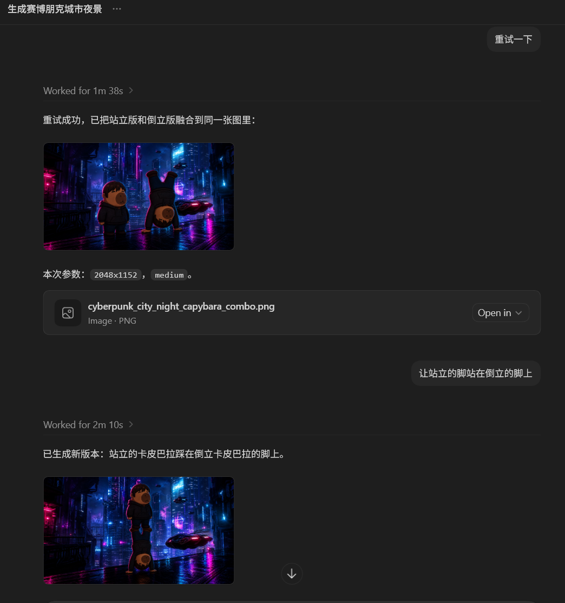
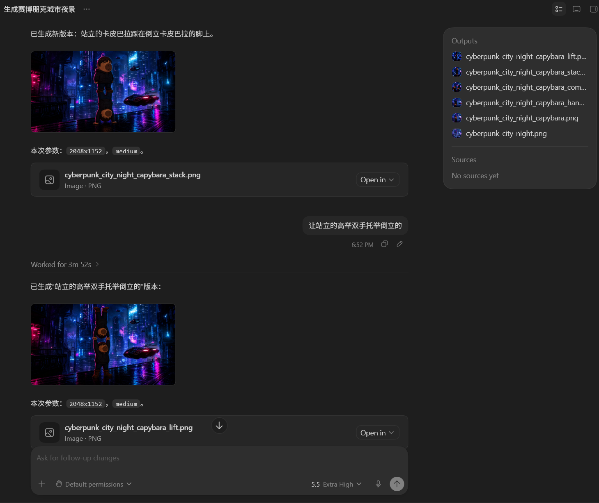

# IntelAlloc Image Skill

Codex skill for generating and editing images through the IntelAlloc image API.

This repository supports English and Chinese users. Install the skill and talk to Codex naturally. Before image generation, it checks the runtime host and model before selecting an API key.

## IntelAlloc Platform

`intelalloc-image` is built specifically for the IntelAlloc platform. It is designed for Codex workflows, enabling GPT to call IntelAlloc's image-2 model reliably for image generation, image editing, reference-image workflows, and iterative follow-up edits.

IntelAlloc registration: https://backend.intelalloc.com/register?promo=JINGGE

Need an invitation code? Contact takeshikaneshivo@gmail.com.





## Quick Start

After installing the skill, generate an image directly:

```text
Use IntelAlloc to generate a futuristic city at night and save it to D:\out\city.png
```

When no save path is specified, Codex saves unique PNGs under `~/Pictures/IntelAlloc/Codex` and WorkBuddy saves them under `~/Pictures/IntelAlloc/WorkBuddy`. Successful requests display the image and a clickable link to the full saved directory path.

## Help

Ask Codex naturally for IntelAlloc image help. A normal customer-facing answer should describe the available image creation, editing, reference-image, batch, size, quality, and save-location options in plain language. It should not display command names, flags, Python code, API endpoints, or internal configuration paths.

For example, you can say: “I want to learn what IntelAlloc can do, the default image quality, and where images are saved.” Codex should answer in natural language, explain that images are saved automatically in a host-specific folder under `IntelAlloc` when no location is given, and explain that an eligible GPT-series key is tried automatically before asking the user for a key.

The bundled read-only help command remains available for developers and troubleshooting; it is an internal technical reference and should not be pasted into an ordinary customer reply.

If the first request is not running on a confirmed GPT model with an eligible host credential, provide an IntelAlloc GPT-series model key locally:

```text
Configure IntelAlloc API key: <your-api-key>
```

Edit an image:

```text
Use IntelAlloc to edit D:\images\source.png into watercolor style and save it to D:\out\watercolor.png
```

Drag an image file into Codex and edit it:

```text
Use the image I just dragged in and turn it into watercolor style, then save it to D:\out\watercolor.png
```

Use a dragged image together with the previous output:

```text
Add the image I just dragged into the previous output, keep the overall style consistent, and save it to D:\out\result.png
```

```text
Use the image I just dragged in as a reference, edit the previous image into the same style, and save it to D:\out\result.png
```

## Install

### Install From GitHub Path

Use this skill path:

```text
skills/intelalloc-image
```

If using Codex skill installer, install from:

```text
https://github.com/<your-user>/intelalloc-image-skill/tree/main/skills/intelalloc-image
```

Replace `<your-user>` with the GitHub account or organization that owns this repository.

### Manual Install

Download:

```text
releases/intelalloc-image-release.zip
```

Unzip it, then unzip the inner `intelalloc-image.zip`.

Place the extracted `intelalloc-image` folder here:

Windows:

```text
C:\Users\<user>\.codex\skills\intelalloc-image
```

WorkBuddy on Windows:

```text
C:\Users\<user>\.workbuddy-ai\skills\intelalloc-image
```

WorkBuddy on macOS:

```text
~/.workbuddy-ai/skills/intelalloc-image
```

Codex on macOS / Linux:

```text
~/.codex/skills/intelalloc-image
```

WorkBuddy integrations on Windows and macOS use the corresponding `.workbuddy-ai/skills/intelalloc-image` directory under the user's home directory. On macOS, use `python3` for direct CLI examples when `python` is unavailable.

Restart or refresh Codex after installation.

## Common Prompts

Without a specified save path, Codex saves generated and edited images under `~/Pictures/IntelAlloc/Codex`, while WorkBuddy uses `~/Pictures/IntelAlloc/WorkBuddy`; batch edits use a unique subdirectory there. A user-provided file path or directory always takes precedence.

### WorkBuddy Runtime Contract

WorkBuddy must provide the host on every skill command so configuration, history, and default output paths stay isolated:

```text
INTELALLOC_RUNTIME_HOST=workbuddy
```

For `generate`, `edit`, and `batch-edit`, it must also provide the exact active model ID:

```text
INTELALLOC_RUNTIME_MODEL=<current-model-id>
```

The same host marker is required for `configure`, `show-config`, `last`, and `history`; the model marker may be included when available. This remains required after an API key has been saved.

Generate:

```text
Use IntelAlloc to generate a product poster and save it to D:\out\poster.png
```

Edit one image:

```text
Use IntelAlloc to edit D:\images\a.png into Japanese anime style and save it to D:\out\a_anime.png
```

Use dragged images:

```text
Use the images I just dragged in as references to generate a product poster and save it to D:\out\poster.png
```

Use a folder as references:

```text
Use images in D:\refs as references to generate a product poster and save it to D:\out\poster.png
```

Batch edit a folder:

```text
Batch edit images in D:\source into pixel art style and save outputs to D:\out
```

Specify size or quality only when you want to override the default for that request:

```text
Use IntelAlloc to generate a 3840x2160 poster with high quality and save it to D:\out\poster.png
```

## Size And Quality

Default size is `2048x1152`; default quality is `medium`.

Each request reports the active size, quality, start time, finish time, and elapsed seconds. Codex will also remind you that size and quality can be changed. Defaults are not changed unless you explicitly ask to change them.

Supported sizes:

```text
1536x1024, 1024x1536, 1024x1024
2048x1152, 1152x2048, 2048x2048
3840x2160, 2160x3840
```

Supported qualities:

```text
low, medium, high
```

## Common Issues

- Missing API key: provide an IntelAlloc GPT-series model API key with `Configure IntelAlloc API key: <your-api-key>`.
- Automatic credentials are used only for a first request on confirmed GPT-series models without a local key. A successful automatic key is saved locally until manually replaced. Use `show-config` to inspect the detected host, model, GPT classification, saved automatic-key state, and key source without revealing the full key.
- Dragged image has no readable local path: provide the local image path manually.
- Previous output is missing: generate or edit an image first, or provide a local input path.
- Cloudflare 1010 / 403: run `show-config` to confirm the automatically generated User-Agent, then retry. If it still fails, the backend access rule may need to allow this API client.
- HTTP 502: the backend or upstream service is temporarily unavailable. Retry later.
- Image path does not exist: provide a readable local file path.
- More than 16 reference images: reduce the folder or explicitly ask Codex to limit to 16 images.

When an API request fails, Codex shows the returned failure reason first and reminds you to retry or try again later.

## Safety And Devices

Codex reads `OPENAI_API_KEY` from `~/.codex/auth.json` only when no skill key is configured and the current host and model are confirmed as Codex + GPT. WorkBuddy must provide `INTELALLOC_RUNTIME_HOST=workbuddy` on every call and `INTELALLOC_RUNTIME_MODEL=<current-model-id>` for image calls; when no skill key exists, the skill reads the matching GPT model's `apiKey` from `~/.workbuddy-ai/models.json`, saves it locally, and then keeps using it until manual replacement. Once a skill key is configured, model changes do not replace it. Unknown/non-GPT contexts use local manual configuration. Skill state is host-specific: Codex uses `~/.codex/intelalloc-image/` and WorkBuddy uses `~/.workbuddy-ai/intelalloc-image/`. This includes `config.json` and `history.json`; `last` and `--from-last` never cross hosts. Unknown hosts retain the legacy Codex state path and the legacy `~/Pictures/IntelAlloc` default output directory. User-specified output paths remain unchanged.

Do not share:

```text
~/.codex/intelalloc-image/config.json
~/.workbuddy-ai/intelalloc-image/config.json
~/.codex/auth.json
~/.workbuddy-ai/models.json
~/.codex/intelalloc-image/history.json
~/.workbuddy-ai/intelalloc-image/history.json
API keys
generated images
temporary files
```

## 中文使用说明

本 skill 是 IntelAlloc 平台专用的 Codex 生图/改图工具，用于让 GPT 在 Codex 会话中稳定调用 IntelAlloc 的 image-2 模型，完成文本生图、图片编辑、参考图编辑和连续追改等工作流。

IntelAlloc 平台注册链接：https://backend.intelalloc.com/register?promo=JINGGE

需要注册邀请码可以联系：takeshikaneshivo@gmail.com

这个 skill 给 Codex 用户使用。安装后，你不需要记 CLI 命令，直接用自然语言告诉 Codex 生成什么图、改哪张图、输出到哪里即可。

### 安装

手动安装时，下载：

```text
releases/intelalloc-image-release.zip
```

解压后，再解压里面的 `intelalloc-image.zip`，把得到的 `intelalloc-image` 文件夹放到：

Windows:

```text
C:\Users\<用户名>\.codex\skills\intelalloc-image
```

Windows WorkBuddy：

```text
C:\Users\<用户名>\.workbuddy-ai\skills\intelalloc-image
```

macOS WorkBuddy：

```text
~/.workbuddy-ai/skills/intelalloc-image
```

macOS / Linux 的 Codex：

```text
~/.codex/skills/intelalloc-image
```

安装后重启或刷新 Codex。

### 帮助

直接对 Codex 说“IntelAlloc 图片帮助”，或自然地询问“可以生成和修改哪些图片”“默认质量是多少”“图片会保存到哪里”。普通回复会用中文说明生成、改图、参考图、批量处理、尺寸质量和保存位置，不要求用户记忆命令，也不会展示内部路径或密钥配置命令。

未指定保存位置时，图片会自动保存到系统图片目录下按宿主区分的 `IntelAlloc` 子目录；也可以直接说“保存到某个文件”或“保存到某个目录”。系统会先尝试使用符合条件的 GPT 系列模型凭据，无法自动使用时再请用户提供 IntelAlloc GPT 系列 API key。

开发者或排障场景仍可使用随技能附带的只读帮助命令查看技术细节；这些命令不属于普通客户的使用方式。

### API key 配置

安装后无需初始化。本地还没有 key 时，第一次正式生图会检查当前宿主和模型。只有确认是 GPT 系列模型时才自动读取宿主凭据并保存到本地；否则请提供 IntelAlloc GPT 系列模型的 API key：

```text
配置 IntelAlloc API key：你的 key
```

只有 skill 尚未配置 key 时，Codex 才会在确认宿主和 GPT 模型后读取 `~/.codex/auth.json` 的 `OPENAI_API_KEY`；WorkBuddy 每次调用都必须注入 `INTELALLOC_RUNTIME_HOST=workbuddy`，图片请求还必须注入 `INTELALLOC_RUNTIME_MODEL=<当前模型 ID>`。skill 会在 `~/.workbuddy-ai/models.json` 中匹配并保存对应 `apiKey`。保存后始终使用该 key，切换模型不会替换；只有手动配置新 key 才会覆盖，且不会修改宿主凭据文件。`configure`、`show-config`、`last` 和 `history` 也必须带宿主标记。

### 生图

未指定保存路径时，Codex 会保存到 `~/Pictures/IntelAlloc/Codex`，WorkBuddy 会保存到 `~/Pictures/IntelAlloc/WorkBuddy`；批量编辑会在对应目录中创建唯一批次目录。请求成功后会展示图片和指向完整实际保存目录的可点击链接。用户提供文件路径或目录时，始终使用客户提供的路径。

```text
用 IntelAlloc 生成一张未来城市夜景，输出到 D:\out\city.png
```

```text
用 IntelAlloc 生成一张产品海报，输出到 D:\out\poster.png
```

### 改图

指定本地图片路径：

```text
用 IntelAlloc 把 D:\images\source.png 改成水彩风，输出到 D:\out\watercolor.png
```

也可以直接把图片文件拖进 Codex，然后说：

```text
把我刚拖进来的图片改成日系动画风格，输出到 D:\out\anime.png
```

如果 Codex 能拿到拖入图片的本地可读路径，就会直接使用这张图。如果拖入图片没有可读取路径，Codex 会要求你补充本地文件路径。

### 拖入图片和上张图联动

如果你刚生成或编辑过一张图，可以把新图片拖进 Codex，并让它和上张输出图一起参与编辑。

把拖入图片内容添加到上一张输出图里：

```text
把我刚拖进来的图片内容添加到上张输出图里，保持整体风格一致，输出到 D:\out\result.png
```

把拖入图片作为参考图，修改上一张输出图：

```text
把我刚拖进来的图片作为参考，基于上张图改成同样风格，输出到 D:\out\result.png
```

这里的“上张图 / 上张输出图”指同一台设备上最近一次成功生成或编辑保存的图片。如果文件被删除，或者换了设备，需要重新指定图片路径。

### 目录参考图

把一个目录里的图片作为参考，生成一张结果图：

```text
读取 D:\refs 里的图片作为参考，生成一张产品海报，输出到 D:\out\poster.png
```

默认只读取目录当前层级的 `.png`、`.jpg`、`.jpeg`、`.webp`。如果要包含子目录，需要明确说明。

### 批量编辑

把目录里的每张图片分别编辑成独立输出：

```text
批量把 D:\source 里的图片改成像素风，输出到 D:\out
```

### 尺寸和质量

默认尺寸是 `2048x1152`，默认质量是 `medium`。

每次请求都会显示当前使用的尺寸、质量、开始时间、结束时间和耗时。Codex 也会提醒你尺寸和质量可以更换。

如果只想这一次改变尺寸或质量，可以直接说：

```text
用 IntelAlloc 生成一张 3840x2160 的海报，质量 high，输出到 D:\out\poster.png
```

如果想修改以后所有请求的默认尺寸或质量，可以说：

```text
把 IntelAlloc 默认尺寸改成 2048x1152，默认质量改成 high
```

### 常见问题

- 缺 API key：重新说 `配置 IntelAlloc API key：你的 key`。
- 宿主未知、模型未知或不是 GPT 系列：请提供 IntelAlloc GPT 系列模型的 API key；可运行 `show-config` 查看检测结果。
- 拖入图片不可读：提供图片的本地文件路径。
- 上张图不存在：重新指定输入图片，或先生成一张新图。
- HTTP 502：后端或上游服务暂时不可用，稍后重试。
- Cloudflare 1010 / 403：运行 `show-config` 确认自动生成的 User-Agent 后重试；如果仍失败，需要后端放行该 API 客户端。
- 参考图超过 16 张：缩小图片范围，或明确让 Codex 只取 16 张。

请求失败时，Codex 会先显示失败原因，再提醒你重试或稍后再试，不会继续做其它图片操作。

### 安全和跨设备

不要分享：

```text
~/.codex/intelalloc-image/config.json
~/.workbuddy-ai/intelalloc-image/config.json
~/.codex/auth.json
~/.workbuddy-ai/models.json
~/.codex/intelalloc-image/history.json
~/.workbuddy-ai/intelalloc-image/history.json
API key
生成图片
临时文件
```

历史记录和“上张图”只在当前设备可靠，换设备后不会自动同步。
